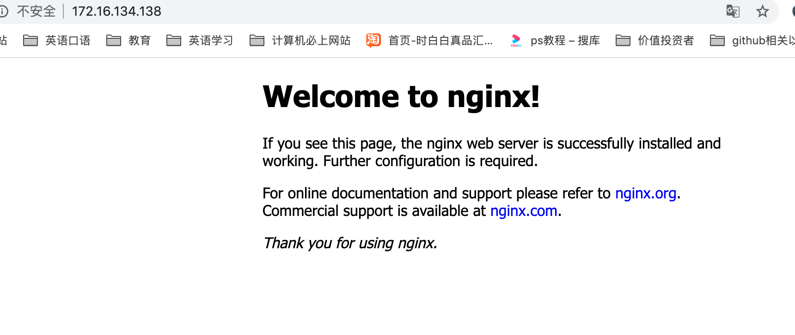
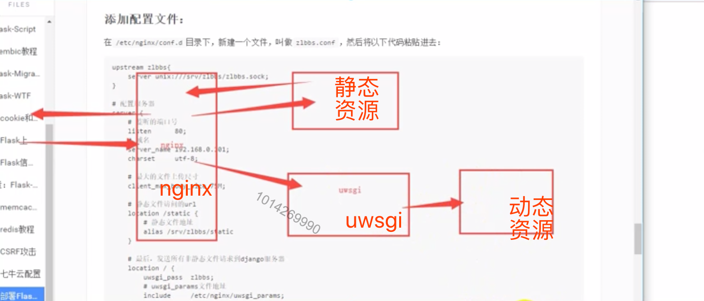
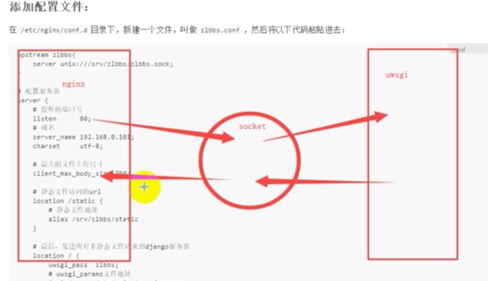

[TOC]
## uwsgi相关配置
```
root@richardhu-virtual-machine:/srv/mybbs# pip3 install uwsgi
Collecting uwsgi
  Downloading https://files.pythonhosted.org/packages/e7/1e/3dcca007f974fe4eb369bf1b8629d5e342bb3055e2001b2e5340aaefae7a/uwsgi-2.0.18.tar.gz (801kB)
     |████████████████████████████████| 808kB 7.0kB/s
Building wheels for collected packages: uwsgi
  Building wheel for uwsgi (setup.py) ... done
  Created wheel for uwsgi: filename=uWSGI-2.0.18-cp36-cp36m-linux_x86_64.whl size=512222 sha256=91bbac70116dedbc9d5b49615b7f83ae2af43dc50a2f0d2a57a2fd168cd04908
  Stored in directory: /root/.cache/pip/wheels/2d/0c/b0/f3ba1bbce35c3766c9dac8c3d15d5431cac57e7a8c4111c268
Successfully built uwsgi
Installing collected packages: uwsgi
Successfully installed uwsgi-2.0.18
root@richardhu-virtual-machine:/srv/mybbs#
```
### uwsgi相关配置
```
root@richardhu-virtual-machine:/srv/mybbs# vim uwsgi.ini
uwsgi.ini内容:
[uwsgi]

# 必须全部为绝对路径
# 项目的路径
chdir           = /srv/mybbs/
# Django的wsgi文件
wsgi-file       = /srv/mybbs/app.py
# 回调的app对象
callable        = app
# Python虚拟环境的路径
home            = /root/.virtualenvs/bbs-env

# 进程相关的设置
# 主进程
master          = true
# 最大数量的工作进程
processes       = 10

http            = :8000

# 设置socket的权限
chmod-socket    = 666
# 退出的时候是否清理环境
vacuum          = true

```
### 运行
```
root@richardhu-virtual-machine:/srv/mybbs# uwsgi --ini uwsgi.ini
[uWSGI] getting INI configuration from uwsgi.ini
*** Starting uWSGI 2.0.18 (64bit) on [Mon Dec 30 22:37:28 2019] ***
compiled with version: 7.5.0 on 30 December 2019 14:19:24
os: Linux-5.0.0-37-generic #40~18.04.1-Ubuntu SMP Thu Nov 14 12:06:39 UTC 2019
nodename: richardhu-virtual-machine
machine: x86_64
clock source: unix
detected number of CPU cores: 1
current working directory: /srv/mybbs
detected binary path: /usr/local/bin/uwsgi
!!! no internal routing support, rebuild with pcre support !!!
uWSGI running as root, you can use --uid/--gid/--chroot options
*** WARNING: you are running uWSGI as root !!! (use the --uid flag) ***
chdir() to /srv/mybbs/
your processes number limit is 15402
your memory page size is 4096 bytes
detected max file descriptor number: 1024
lock engine: pthread robust mutexes
thunder lock: disabled (you can enable it with --thunder-lock)
uWSGI http bound on :5000 fd 4
uwsgi socket 0 bound to TCP address 127.0.0.1:35421 (port auto-assigned) fd 3
uWSGI running as root, you can use --uid/--gid/--chroot options
*** WARNING: you are running uWSGI as root !!! (use the --uid flag) ***
Python version: 3.6.9 (default, Nov 7 2019, 10:44:02) [GCC 8.3.0]
Set PythonHome to /root/.virtualenvs/bbs-env
*** Python threads support is disabled. You can enable it with --enable-threads ***
Python main interpreter initialized at 0x55eec24d65e0
uWSGI running as root, you can use --uid/--gid/--chroot options
*** WARNING: you are running uWSGI as root !!! (use the --uid flag) ***
your server socket listen backlog is limited to 100 connections
your mercy for graceful operations on workers is 60 seconds
mapped 801944 bytes (783 KB) for 10 cores
*** Operational MODE: preforking ***
WSGI app 0 (mountpoint='') ready in 1 seconds on interpreter 0x55eec24d65e0 pid: 22969 (default app)
uWSGI running as root, you can use --uid/--gid/--chroot options
*** WARNING: you are running uWSGI as root !!! (use the --uid flag) ***
*** uWSGI is running in multiple interpreter mode ***
spawned uWSGI master process (pid: 22969)
spawned uWSGI worker 1 (pid: 22973, cores: 1)
spawned uWSGI worker 2 (pid: 22974, cores: 1)
spawned uWSGI worker 3 (pid: 22975, cores: 1)
spawned uWSGI worker 4 (pid: 22976, cores: 1)
spawned uWSGI worker 5 (pid: 22977, cores: 1)
spawned uWSGI worker 6 (pid: 22978, cores: 1)
spawned uWSGI worker 7 (pid: 22979, cores: 1)
spawned uWSGI worker 8 (pid: 22980, cores: 1)
spawned uWSGI worker 9 (pid: 22981, cores: 1)
spawned uWSGI worker 10 (pid: 22982, cores: 1)
spawned uWSGI http 1 (pid: 22983)
```

## Nginx相关配置
### 安装
```
root@richardhu-virtual-machine:/srv/mybbs# apt install nginx
正在读取软件包列表... 完成
正在分析软件包的依赖关系树
正在读取状态信息... 完成
正在选中未选择的软件包 libnginx-mod-http-image-filter。
正准备解包 .../2-libnginx-mod-http-image-filter_1.14.0-0ubuntu1.6_amd64.deb ...
正在解包 libnginx-mod-http-image-filter (1.14.0-0ubuntu1.6) ...
正在选中未选择的软件包 libnginx-mod-http-xslt-filter。
正准备解包 .../3-libnginx-mod-http-xslt-filter_1.14.0-0ubuntu1.6_amd64.deb ...
正在解包 libnginx-mod-http-xslt-filter (1.14.0-0ubuntu1.6) ...
正在选中未选择的软件包 libnginx-mod-mail。
正准备解包 .../4-libnginx-mod-mail_1.14.0-0ubuntu1.6_amd64.deb ...
正在解包 libnginx-mod-mail (1.14.0-0ubuntu1.6) ...
正在选中未选择的软件包 libnginx-mod-stream。
正准备解包 .../5-libnginx-mod-stream_1.14.0-0ubuntu1.6_amd64.deb ...
正在解包 libnginx-mod-stream (1.14.0-0ubuntu1.6) ...
正在选中未选择的软件包 nginx-core。
正准备解包 .../6-nginx-core_1.14.0-0ubuntu1.6_amd64.deb ...
正在解包 nginx-core (1.14.0-0ubuntu1.6) ...
正在选中未选择的软件包 nginx。
正准备解包 .../7-nginx_1.14.0-0ubuntu1.6_all.deb ...
正在解包 nginx (1.14.0-0ubuntu1.6) ...
正在处理用于 ufw (0.35-5) 的触发器 ...
正在处理用于 ureadahead (0.100.0-20) 的触发器 ...
正在设置 nginx-common (1.14.0-0ubuntu1.6) ...
Created symlink /etc/systemd/system/multi-user.target.wants/nginx.service → /lib/systemd/system/nginx.service.
正在设置 libnginx-mod-http-image-filter (1.14.0-0ubuntu1.6) ...
正在处理用于 systemd (237-3ubuntu10.29) 的触发器 ...
正在设置 libnginx-mod-mail (1.14.0-0ubuntu1.6) ...
正在处理用于 man-db (2.8.3-2ubuntu0.1) 的触发器 ...
正在设置 libnginx-mod-http-xslt-filter (1.14.0-0ubuntu1.6) ...
正在设置 libnginx-mod-http-geoip (1.14.0-0ubuntu1.6) ...
正在设置 libnginx-mod-stream (1.14.0-0ubuntu1.6) ...
正在设置 nginx-core (1.14.0-0ubuntu1.6) ...
正在设置 nginx (1.14.0-0ubuntu1.6) ...
正在处理用于 ureadahead (0.100.0-20) 的触发器 ...
正在处理用于 ufw (0.35-5) 的触发器 ...
#启动
root@richardhu-virtual-machine:/srv/mybbs# service nginx start
```





### nginx配置
在`/etc/nginx/conf.d`目录下，新建一个文件，叫做mybbs.conf，然后将以下代码粘贴进去：

```
upstream mybbs{
    server unix:///srv/mybbs/mybbs.sock; 
}

# 配置服务器
server {
    # 监听的端口号
    listen      80;
    # 域名(或者ip)
    server_name 172.16.134.138; 
    #编码
    charset     utf-8;

    # 最大的文件上传尺寸
    client_max_body_size 75M;  

    # 静态文件访问的url
    location /static {
        # 静态文件地址
        alias /srv/mybbs/static;
    }

    # 最后，发送所有非静态文件请求到django(flask)服务器
    location / {
        uwsgi_pass  mybbs;
        # uwsgi_params文件地址
        include     /etc/nginx/uwsgi_params; 
    }
}

```




```
root@richardhu-virtual-machine:/srv/mybbs# cd /etc/nginx/conf.d
root@richardhu-virtual-machine:/etc/nginx/conf.d# pwd
/etc/nginx/conf.d
root@richardhu-virtual-machine:/etc/nginx/conf.d# ls
root@richardhu-virtual-machine:/etc/nginx/conf.d# touch mybbs.conf
root@richardhu-virtual-machine:/etc/nginx/conf.d# ls
mybbs.conf
root@richardhu-virtual-machine:/etc/nginx/conf.d# vim mybbs.conf
相关配置见上
```
重新配置修改uwsgi.ini
```
[uwsgi]
chdir = /srv/mybbs/

wsgi-file =/srv/mybbs/app.py

callable = app

home = /root/.virtualenvs/bbs-env

#进程相关设置
#主进程
master = true

#最大数量的工作进程
processes = 10

#http = :5000

#这里要与nginx对应
socket = /srv/mybbs/mybbs.sock

chmod-scoket = 666

vacuum = true
```
测试:
```
root@richardhu-virtual-machine:/srv/mybbs# service nginx configtest
 * Testing nginx configuration [ OK ]
```

### 出问题里(uwsgi那边修改了)

记录:
uwsgi.ini
```
[uwsgi]
chdir = /srv/mybbs/

wsgi-file =/srv/mybbs/app.py

callable = app

home = /root/.virtualenvs/bbs-env

#进程相关设置
#主进程
master = true

#最大数量的工作进程
processes = 10

#http = :5000

socket = /srv/mybbs/mybbs.sock

#后面发现这里有问题
#chmod-scoket = 666
#这样是正确的
chmod-socket = 666


vacuum = true
```


nginx配置文件:
```
root@richardhu-virtual-machine:/srv/mybbs# cat /etc/nginx/conf.d/mybbs.conf
upstream mybbs{
    server unix:///srv/mybbs/mybbs.sock;
}

# 配置服务器
server {
    # 监听的端口号
    listen 80;
    # 域名(或者ip)
    server_name 172.16.134.138;
    #编码
    charset utf-8;

    # 最大的文件上传尺寸
    client_max_body_size 75M;

    # 静态文件访问的url
    location /static {
        # 静态文件地址
        alias /srv/mybbs/static;
    }

    # 最后，发送所有非静态文件请求到django(flask)服务器
    location / {
        uwsgi_pass mybbs;
        # uwsgi_params文件地址
        include /etc/nginx/uwsgi_params;
    }
}{
    # 监听的端口号
    listen 80;
    # 域名(或者ip)
    server_name 172.16.134.138;
    #编码
    charset utf-8;

    # 最大的文件上传尺寸
    client_max_body_size 75M;

    # 静态文件访问的url
    location /static {
        # 静态文件地址
        alias /srv/mybbs/static;
    }

    # 最后，发送所有非静态文件请求到django(flask)服务器
    location / {
        uwsgi_pass mybbs;
        # uwsgi_params文件地址
        include /etc/nginx/uwsgi_params;
    }
}
```

## 重新运行
```
root@richardhu-virtual-machine:/srv/mybbs# service nginx restart
root@richardhu-virtual-machine:/srv/mybbs# uwsgi --ini uwsgi.ini
====================================================================================================================
[uWSGI] getting INI configuration from uwsgi.ini
*** Starting uWSGI 2.0.18 (64bit) on [Tue Dec 31 10:26:21 2019] ***
compiled with version: 7.5.0 on 30 December 2019 14:19:24
os: Linux-5.0.0-37-generic #40~18.04.1-Ubuntu SMP Thu Nov 14 12:06:39 UTC 2019
nodename: richardhu-virtual-machine
machine: x86_64
clock source: unix
detected number of CPU cores: 1
current working directory: /srv/mybbs
detected binary path: /usr/local/bin/uwsgi
!!! no internal routing support, rebuild with pcre support !!!
uWSGI running as root, you can use --uid/--gid/--chroot options
*** WARNING: you are running uWSGI as root !!! (use the --uid flag) ***
chdir() to /srv/mybbs/
your processes number limit is 15402
your memory page size is 4096 bytes
detected max file descriptor number: 1024
lock engine: pthread robust mutexes
thunder lock: disabled (you can enable it with --thunder-lock)
uwsgi socket 0 bound to UNIX address /srv/mybbs/mybbs.sock fd 3
uWSGI running as root, you can use --uid/--gid/--chroot options
*** WARNING: you are running uWSGI as root !!! (use the --uid flag) ***
Python version: 3.6.9 (default, Nov 7 2019, 10:44:02) [GCC 8.3.0]
Set PythonHome to /root/.virtualenvs/bbs-env
*** Python threads support is disabled. You can enable it with --enable-threads ***
Python main interpreter initialized at 0x55e8c715c060
uWSGI running as root, you can use --uid/--gid/--chroot options
*** WARNING: you are running uWSGI as root !!! (use the --uid flag) ***
your server socket listen backlog is limited to 100 connections
your mercy for graceful operations on workers is 60 seconds
mapped 801944 bytes (783 KB) for 10 cores
*** Operational MODE: preforking ***
WSGI app 0 (mountpoint='') ready in 24 seconds on interpreter 0x55e8c715c060 pid: 9031 (default app)
uWSGI running as root, you can use --uid/--gid/--chroot options
*** WARNING: you are running uWSGI as root !!! (use the --uid flag) ***
*** uWSGI is running in multiple interpreter mode ***
spawned uWSGI master process (pid: 9031)
spawned uWSGI worker 1 (pid: 9035, cores: 1)
spawned uWSGI worker 2 (pid: 9036, cores: 1)
spawned uWSGI worker 3 (pid: 9037, cores: 1)
spawned uWSGI worker 4 (pid: 9038, cores: 1)
spawned uWSGI worker 5 (pid: 9039, cores: 1)
spawned uWSGI worker 6 (pid: 9040, cores: 1)
spawned uWSGI worker 7 (pid: 9041, cores: 1)
spawned uWSGI worker 8 (pid: 9042, cores: 1)
spawned uWSGI worker 9 (pid: 9043, cores: 1)
spawned uWSGI worker 10 (pid: 9044, cores: 1)
Tue Dec 31 10:26:48 2019 - SIGPIPE: writing to a closed pipe/socket/fd (probably the client disconnected) on request / (ip 172.16.134.1) !!!
Tue Dec 31 10:26:48 2019 - uwsgi_response_writev_headers_and_body_do(): Broken pipe [core/writer.c line 306] during GET / (172.16.134.1)
OSError: write error
[pid: 9035|app: 0|req: 1/1] 172.16.134.1 () {42 vars in 859 bytes} [Tue Dec 31 10:26:46 2019] GET / => generated 0 bytes in 1829 msecs (HTTP/1.1 200) 3 headers in 0 bytes (0 switches on core 0)
[pid: 9036|app: 0|req: 1/2] 172.16.134.1 () {42 vars in 859 bytes} [Tue Dec 31 10:26:46 2019] GET / => generated 6000 bytes in 1825 msecs (HTTP/1.1 200) 3 headers in 95 bytes (1 switches on core 0)
[pid: 9044|app: 0|req: 1/3] 172.16.134.1 () {42 vars in 799 bytes} [Tue Dec 31 10:26:49 2019] GET /favicon.ico => generated 232 bytes in 5 msecs (HTTP/1.1 404) 2 headers in 72 bytes (1 switches on core 0)

```